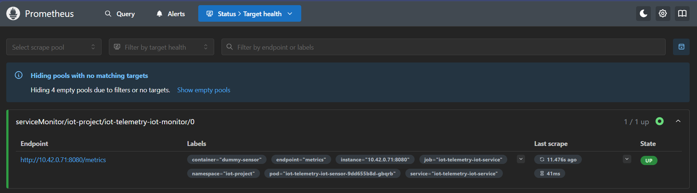
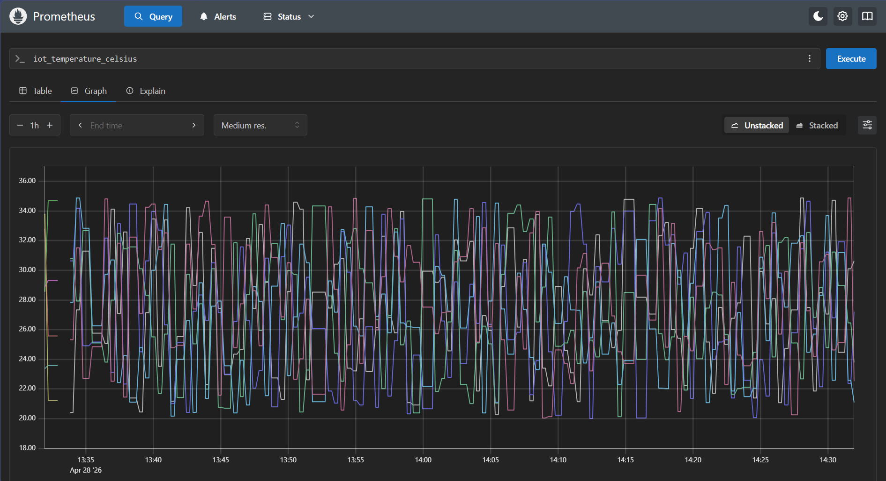
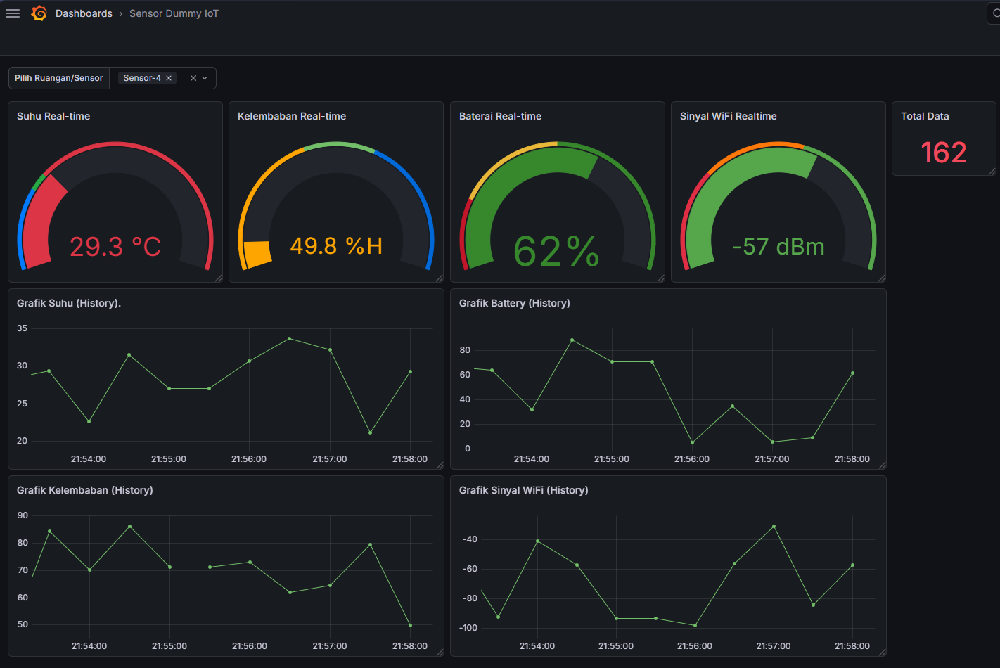
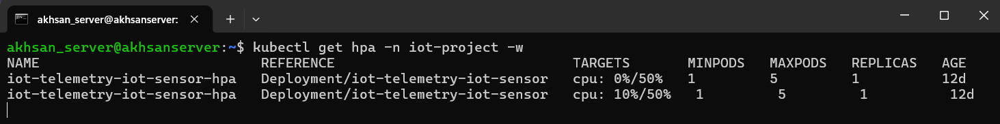
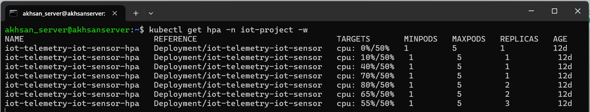
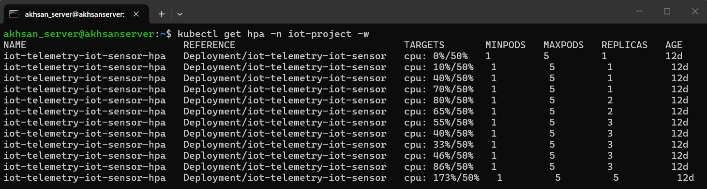
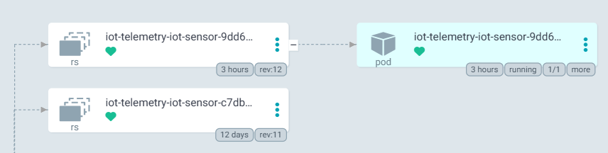
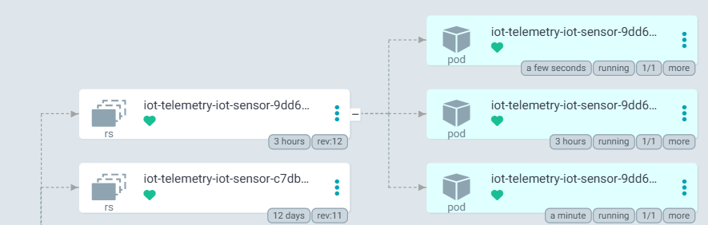
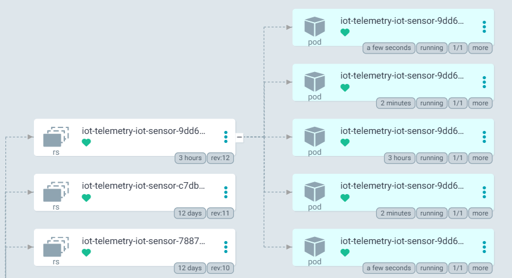

# 🚀 Edge IoT Telemetry Pipeline: From Legacy to Kubernetes

Production-like IoT telemetry pipeline running on Raspberry Pi (k3s), featuring real-time monitoring, autoscaling (HPA), and GitOps deployment with ArgoCD.

Designed to simulate real-world cloud-native and edge computing workloads.

Tested with load simulation to validate:
- 📈 Horizontal scaling behavior
- 📊 Real-time observability (Prometheus + Grafana)
- 🔄 Continuous deployment via GitOps


## 🔥 Project Highlights

- 🚀 Built full IoT pipeline on **edge device (Raspberry Pi)**
- 📊 Implemented **real-time metrics monitoring (Prometheus + Grafana)**
- ⚖️ Validated **Kubernetes HPA autoscaling under load**
- 🔄 Applied **GitOps deployment using ArgoCD**
- 🧪 Performed **load testing to simulate real traffic**

## 📌 Overview

This project simulates a real-world IoT telemetry pipeline, evolving from a simple script into a cloud-native, Kubernetes-based system with:

- 📡 Simulated IoT sensors (temperature, humidity, battery, signal)
- 📊 Observability stack (Prometheus + Grafana)
- ⚖️ Autoscaling using Kubernetes HPA
- 🔄 GitOps deployment with ArgoCD
- 🧱 ARM-based edge infrastructure (Raspberry Pi 4B + k3s)

## ⚡ Key Features

### 🔧 IoT Telemetry Simulation
- Multi-sensor data generation (5 nodes)
- Realistic metrics (temperature, humidity, battery, RSSI)
- Error simulation for reliability testing

### 📊 Observability (Metrics Pipeline)
- Metrics exposed via /metrics
- Scraped by Prometheus
- Visualized in Grafana

### ⚖️ Autoscaling
- Kubernetes Horizontal Pod Autoscaler (HPA)
- CPU-based scaling under simulated load
- Real-time validation using load generator

### 🔄 GitOps Deployment
- Continuous deployment using Argo CD
- Declarative Helm-based configuration
- Image updates via CI pipeline

### 🧱 Edge Computing
- Runs on Raspberry Pi 4B (ARM64)
- Uses k3s (lightweight Kubernetes)
- Optimized for low-resource environments

## 🧠 Architecture

```
┌───────────────┐
│ IoT Sensors   │ (Simulated in Go)
└──────┬────────┘
       │ /metrics
       ▼
┌───────────────┐
│ Prometheus    │ ← ServiceMonitor
└──────┬────────┘
       ▼
┌───────────────┐
│ Grafana       │ (Dashboard)
└──────┬────────┘
       ▼
┌───────────────┐
│ Kubernetes    │ (HPA Scaling)
└──────┬────────┘
       ▼
┌───────────────┐
│ ArgoCD        │ (GitOps Sync)
└───────────────┘
```

## ⚠️ Limitations

- Uses CPU-based HPA (not custom metrics yet)
- Simulated data (not real hardware sensors)
- Single-node k3s cluster (not HA)

## 🔮 Future Improvements

- Use Prometheus Adapter for custom metrics (QPS-based scaling)
- Integrate MQTT for real telemetry ingestion
- Multi-node Kubernetes cluster

## 🔄 CI/CD & Deployment Flow

1. Push code to GitHub
2. CI builds Docker image (multi-arch)
3. Image pushed to private registry
4. Manifest updated (Helm values)
5. ArgoCD detects changes
6. Deployment synced to k3s cluster
7. Prometheus starts scraping metrics
8. Grafana visualizes data
9. HPA scales pods based on load

## 📊 Observability & Autoscaling Validation

### 🔍 1. Prometheus Target Discovery

Prometheus successfully scrapes metrics from IoT service.



### 📈 2. Real-Time Metrics Query

Example query: `iot_temperature_celsius`



### 📊 3. Grafana Dashboard

Visualized metrics:
- Temperature
- Humidity
- Battery
- Signal strength



### ⚖️ 4. Autoscaling (HPA)

Load testing performed using busybox:

```bash
kubectl run load-generator --rm -it \
--image=busybox:1.28 \
--restart=Never \
-n iot-project \
-- /bin/sh -c "while true; do wget -q -O - http://iot-service:8080/metrics > /dev/null; sleep 1; done"
```

Result:
- CPU usage increased from ~10m → ~50m under sustained load
- HPA scaled pods from 1 → 5 replicas automatically
- Scaling triggered based on 50% CPU utilization threshold
- No downtime observed during scaling events

**Initial State (1 pod)**


**Under Load (CPU ~50m)**


**Peak (5 pods scaled)**


### 🔄 5. GitOps Visibility (ArgoCD)

| State | Screenshot |
|-------|------------|
| **Detected** |  |
| **Syncing** |  |
| **Healthy** |  |

## 💼 Why This Project Matters

This project simulates real-world DevOps scenarios:

- Handling telemetry data from distributed systems
- Monitoring system health in real-time
- Scaling workloads dynamically based on demand
- Managing deployments using GitOps principles

This reflects production patterns used in:
- IoT platforms
- Edge computing systems
- Cloud-native microservices architectures

## 🛠️ Tech Stack

| Category | Technology |
|----------|------------|
| Language | Go |
| Container | Docker (multi-arch) |
| Orchestration | Kubernetes (k3s) |
| Monitoring | Prometheus |
| Visualization | Grafana |
| GitOps | ArgoCD |
| Infrastructure | Raspberry Pi 4B |

## 📂 Project Structure

```
iot-telemetry/
├── backend/                  # Go IoT sensor application
│   ├── main.go               # Sensor logic
│   ├── go.mod                # Go module dependencies
│   └── Dockerfile            # Multi-stage build for amd64 & arm64
├── iot-chart/                # Helm chart for Kubernetes deployment
│   ├── Chart.yaml            # Chart metadata & version
│   ├── values.yaml           # Default configuration values
│   ├── dashboards/
│   │   └── dashboard.json    # Grafana dashboard
│   └── templates/
│       ├── deployment.yaml
│       ├── service.yaml
│       ├── hpa.yaml
│       ├── servicemonitor.yaml
│       └── configmap-dashboard.yaml
├── k8s/                      # Raw Kubernetes manifests (legacy)
│   └── deployment.yaml
├── .github/workflows/         # CI/CD automation
│   └── docker-build.yml
└── assets/                   # Project documentation screenshots
```

## 🎯 Skills Demonstrated

### 🔧 DevOps & Cloud Native
- Kubernetes deployment & autoscaling
- Helm chart templating
- GitOps workflow (ArgoCD)

### 📊 Observability
- Prometheus metrics design
- Grafana dashboard creation
- ServiceMonitor integration

### ⚙️ Backend Engineering
- Go-based telemetry service
- Structured logging (JSON)
- Metrics instrumentation

### 🧱 Infrastructure
- Edge deployment (Raspberry Pi)
- ARM64 containerization
- Resource optimization

## 💡 Key Takeaways

- Built end-to-end telemetry pipeline
- Implemented real observability flow
- Validated autoscaling behavior under load
- Applied GitOps principles in production-like setup
- Optimized for edge computing environment

## 👤 Author

**Akhsan Daffa Pasha**

GitHub: https://github.com/AkhsanDaffa

Focus: DevOps, Cloud Native, Edge Computing