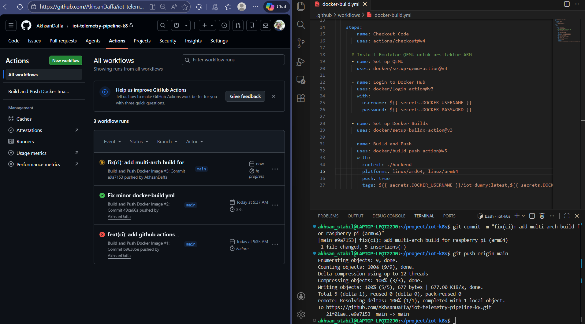
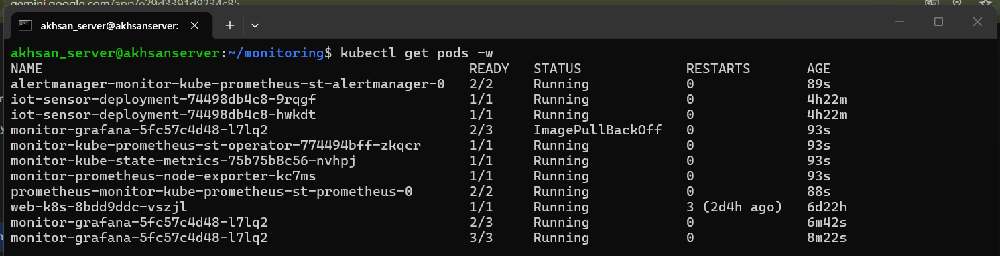
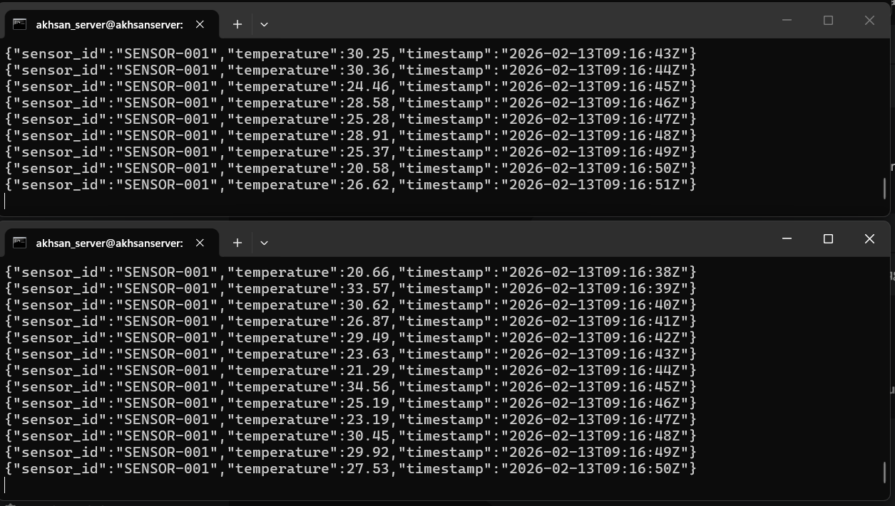
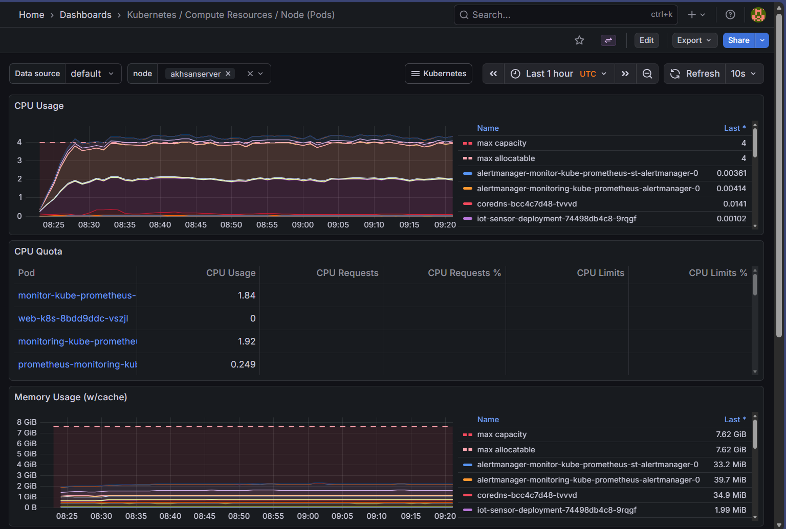

# 🚀 Edge IoT Telemetry Pipeline: From Legacy to Kubernetes


## 📌 Project Overview
This project demonstrates the migration of a dummy IoT sensor application from a legacy Docker Compose environment to a robust **Edge Kubernetes Cluster (K3s)** running on a Raspberry Pi. The primary goal is to establish a scalable, automated, and observable infrastructure suitable for Edge Computing scenarios.

**Development Workflow:** Prototyped and tested on WSL (Windows Subsystem for Linux) before deploying to production Raspberry Pi K3s cluster.

## ✨ Key Achievements & Features

* **Multi-Architecture CI/CD Pipeline:** Engineered a GitHub Actions workflow to automatically build and push Docker images supporting both `linux/amd64` and `linux/arm64` architectures, ensuring seamless deployment across different hardware environments.
* **Infrastructure as Code (IaC) with Helm:** Transitioned from static YAML manifests to dynamic **Helm Charts**, enabling templated deployments, easy rollbacks, and scalable application management.
* **Edge Computing Deployment:** Successfully deployed and stabilized the microservices architecture on a resource-constrained ARM64 device (Raspberry Pi) using K3s.
* **Enterprise-Grade Observability:** Replaced basic monitoring with the `kube-prometheus-stack` (Prometheus Operator & Grafana) to achieve deep Kubernetes pods and cluster metrics monitoring, auto-discovery, and visual dashboards.

## 🛠️ Tech Stack
* **Containerization:** Docker
* **Orchestration:** K3s (Lightweight Kubernetes)
* **Package Manager:** Helm v3
* **CI/CD:** GitHub Actions
* **Monitoring/Observability:** Prometheus, Grafana, Node Exporter, Kube-State-Metrics
* **Hardware:** Raspberry Pi (ARM64)

## 📂 Project Structure
```
.
├── backend/                    # Go IoT sensor application
│   ├── main.go                 # Sensor logic - generates random temperature data
│   ├── go.mod                  # Go module dependencies
│   └── Dockerfile              # Multi-stage build for amd64 & arm64
├── iot-chart/                  # Helm chart for Kubernetes deployment
│   ├── Chart.yaml              # Chart metadata & version
│   ├── values.yaml             # Default configuration values
│   └── templates/
│       └── deployment.yaml     # K8s deployment manifest
├── k8s/                        # Raw Kubernetes manifests
│   └── deployment.yaml         # Basic K8s deployment (legacy)
├── .github/workflows/          # CI/CD automation
│   └── docker-build.yml        # Multi-arch Docker image build & push
└── assets/                     # Project documentation screenshots
```

## 🎯 Skills Demonstrated
| Category | Technologies |
|----------|--------------|
| **Languages** | Go, YAML |
| **Containerization** | Docker, Docker Compose |
| **Orchestration** | Kubernetes, K3s |
| **CI/CD** | GitHub Actions |
| **Monitoring** | Prometheus, Grafana |
| **Tools** | Helm, kubectl |

## 📸 Project Showcase

### 1. Multi-Arch CI/CD Pipeline (GitHub Actions)
*Successfully building and pushing images for both AMD64 and ARM64 architectures.*


### 2. Kubernetes Pods Status & Workloads
*All microservices and enterprise monitoring stacks are running smoothly inside the K3s cluster.*


### 3. IoT Sensor Data Generation
*The deployed dummy sensor generating and transmitting real-time telemetry data.*


### 4. Infrastructure Observability (Grafana)
*Real-time cluster compute resources monitoring using the Kube-Prometheus-Stack.*


---
*Developed by Akhsan - Building scalable infrastructure for the future of IoT.*